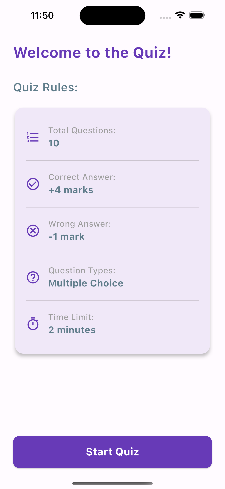
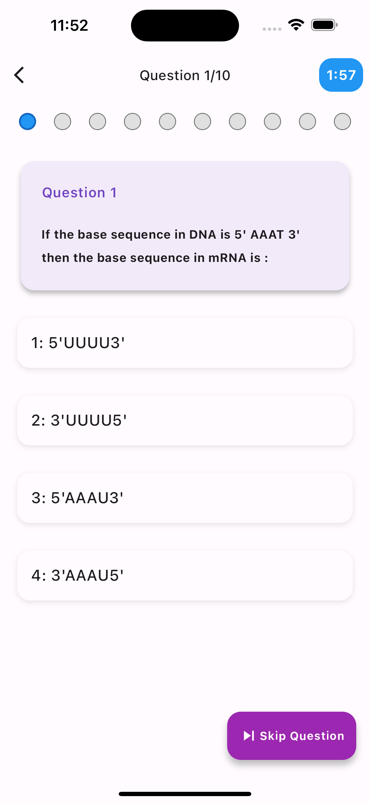
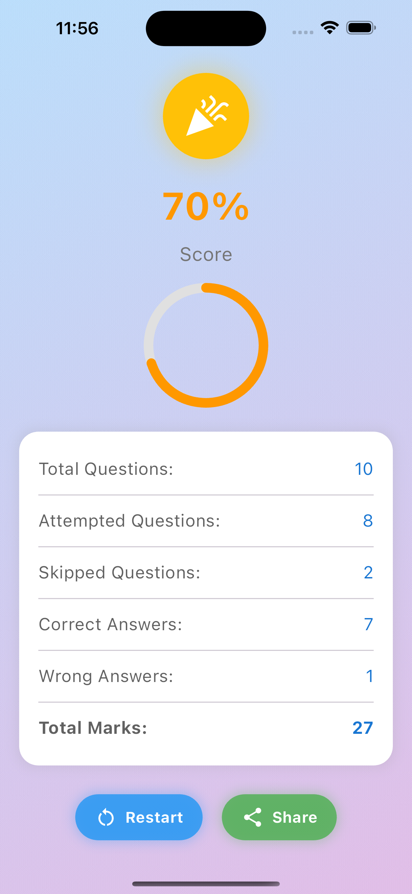
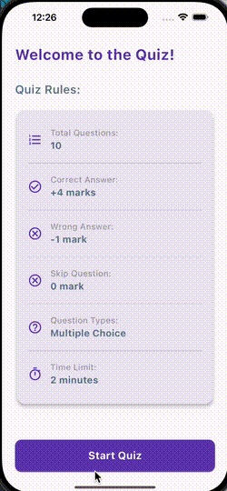

# QuizFlutter - Interactive Quiz Application

[](https://flutter.dev)
[](https://dart.dev)

A feature-rich quiz application built with Flutter that offers timed questions, progress tracking, and detailed result analytics.

## Features ✨
- ⏳ Timed quiz sessions with countdown timer
- 📊 Real-time progress indicator for questions
- 🏆 Score calculation with +4/-1 marking system
- 📈 Detailed result breakdown with analytics
- 🎨 Smooth animations and transitions
- 📱 Responsive UI for all screen sizes
- 🔄 State persistence using Provider
- 🚦 Error handling and loading states

## Screenshots 📸

| Start Screen                                   | Quiz Screen                                  | Results Screen                                     |
|------------------------------------------------|----------------------------------------------|----------------------------------------------------|
|  |  |  |

## Video Walkthrough 📸

## Tech Stack 💻
- **Framework**: Flutter
- **Language**: Dart
- **State Management**: Provider
- **Animation**: Built-in Flutter animations


## Getting Started 🚀

### Prerequisites
- Flutter SDK (>=3.0.0)
- Dart (>=2.17.0)
- Android Studio/VSCode with Flutter extension

### Installation
1. Clone the repository:
```bash
git clone https://github.com/yourusername/quiz_flutter.git
cd quiz_flutter